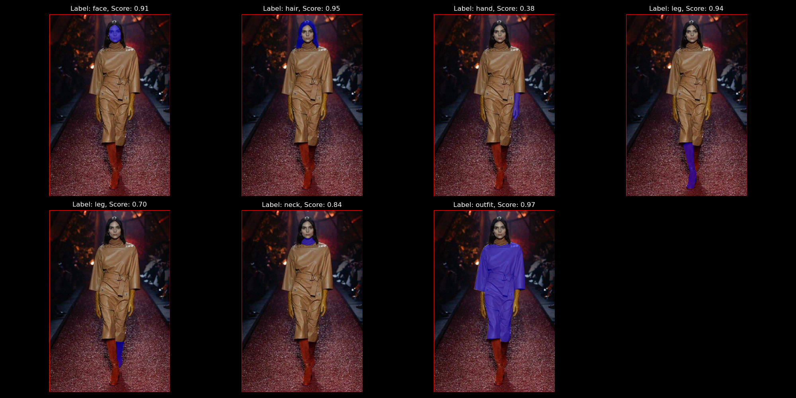

<div align="left">
<h1>YOLO Segmentation Model for Human Body Parts and Objects
</h1>
</div>
<a href='https://huggingface.co/spaces/jordandavis/YOLO-Human-Parse'></a>
<br>
<br>



This repository contains a fine-tuned YOLO (You Only Look Once) segmentation model designed to detect and segment various human body parts and clothing in images.

## Model Overview

The model is based on the YOLO architecture and has been fine-tuned to detect and segment the following classes:

0. Hair
1. Face
2. Neck
3. Arm
4. Hand
5. Back
6. Leg
7. Foot
8. Outfit
9. Person
10. Phone

## Installation

To use this model, you'll need to have the appropriate YOLO framework installed. Please follow these steps:

1. Clone this repository:
   ```
   git clone https://github.com/your-username/yolo-segmentation-human-parts.git
   cd yolo-segmentation-human-parts
   ```

2. Install the required dependencies:
   ```
   pip install -r requirements.txt
   ```

## Usage

To use the model for inference, you can use the following Python script:

### Download the model file

[Download yolo-human-parse-epoch-125.pt from 🤗 Hugging Face](https://huggingface.co/spaces/jordandavis/YOLO-Human-Parse/tree/main)

Place the model file in the weights directory.

### Inference
```python
from ultralytics import YOLO

# Load the model
model = YOLO('path/to/your/model.pt')

# Perform inference on an image
results = model('path/to/your/image.jpg')

# Process the results
for result in results:
    boxes = result.boxes  # Bounding boxes
    masks = result.masks  # Segmentation masks
    # Further processing...
```

## Training

If you want to further fine-tune the model on your own dataset, please follow these steps:

1. Prepare your dataset in the YOLO format.
2. Update the training script to point to your dataset.
3. Run the training script:
   ```
   python scripts/train.py
   ```

## Contributing

Contributions to improve the model or extend its capabilities are welcome. Please submit a pull request or open an issue to discuss proposed changes.

## License

This project is licensed under the MIT License - see the [LICENSE](LICENSE) file for details.

## Acknowledgments

- Thanks to the YOLO team for the original implementation.
- Gratitude to all contributors who helped in fine-tuning and improving this model.